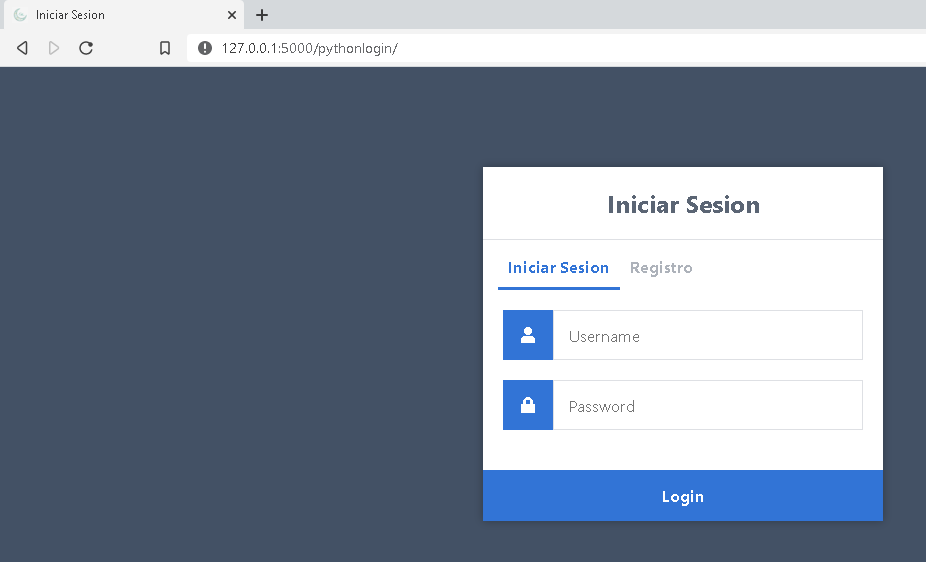
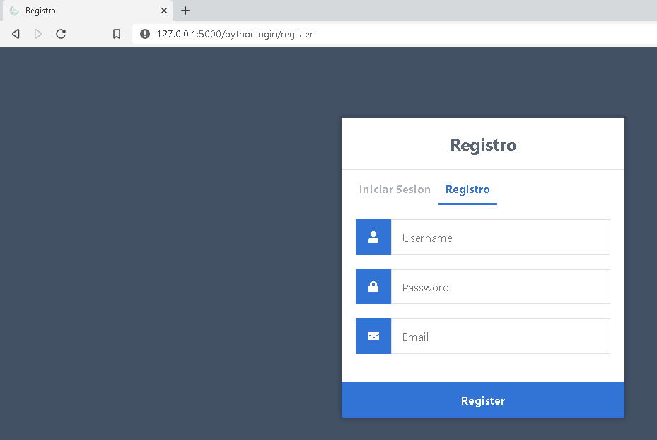
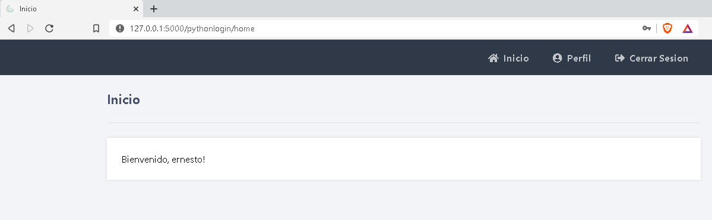
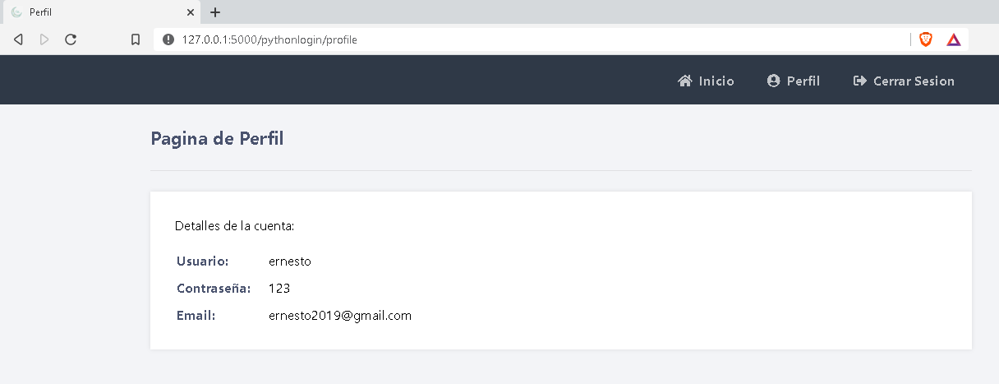

# Python-Flask-Login

#
**Tecnologias utilizadas** 


-Python 3.8.5

-Flask 1.1.2

-Mysql

-CSS

## Inicio de sesión 



## Registro 



## Inicio 


## Perfil 




# Instalar dependencias
```
- pip install -r requirements.txt

```


